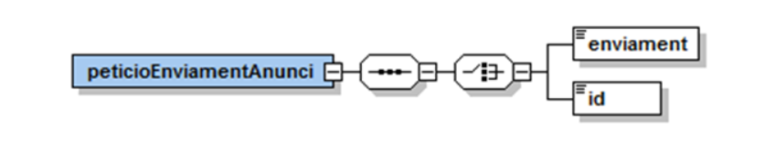
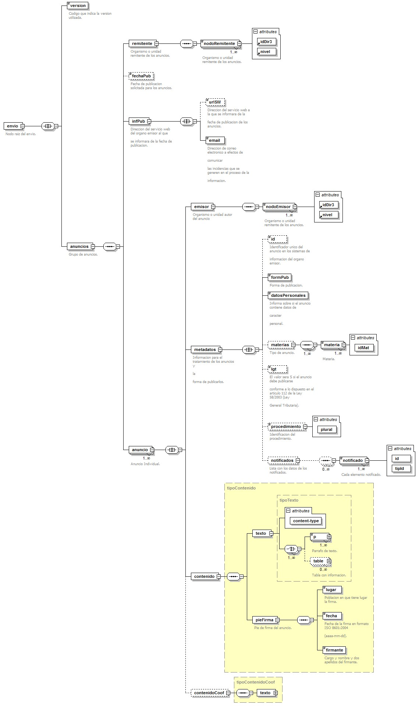
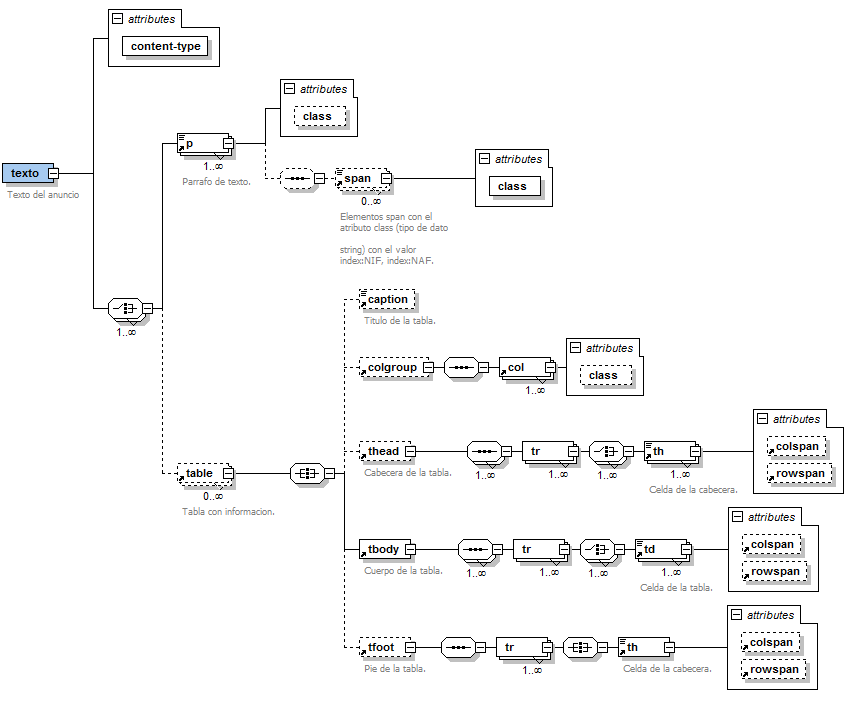
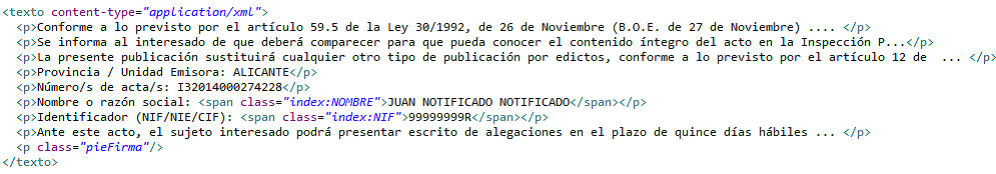
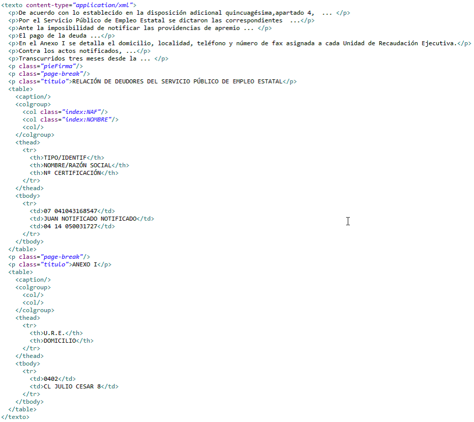
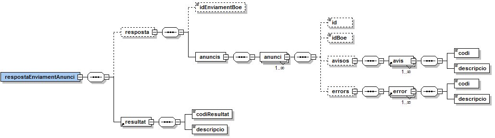
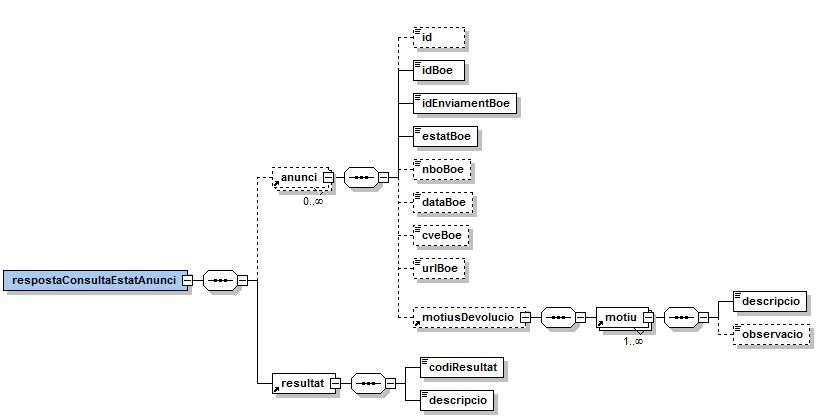
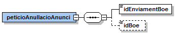

# BOE
Documentació d'integració del servei BOE del Consorci AOC

## **BOE - Tablón Edictal Único**

# 1 Introducció

Aquest document detalla la missatgeria associada al servei de publicació del Tablón Edictal Único del BOE (en endavant TEU).

Per poder realitzar la integració cal conèixer prèviament la següent documentació:

- [Document d&#39;_Especificació de missatgeria pel consum de productes de la plataforma PCI_ del Consorci AOC.](https://github.com/ConsorciAOC/PCI)

# 2 Transmissions de dades disponibles

Les operacions disponibles a través del servei són les que es presenten a continuació:

| **EMISSOR** |
| --- |
| BOE (Boletín Oficial del Estado) |

| **PRODUCTE** | **MODALITAT** | **DESCRIPCIÓ** |
| --- | --- | --- |
| **BOE** | BOE | Operacions del servei de publicació del BOE:<ul><li>Sol·licitud de publicació d&#39;un anunci.</li><li>Consulta d&#39;estat d&#39;enviaments i anuncis que s&#39;han enviat.</li><li>Anul·lació de publicació.</li>|


# 3 Missatgeria del servei

A continuació es detalla la missatgeria corresponent al bloc de dades específiques de les diferents operacions del servei.

## 3.1 Sol·licitud de publicació

---
 Aquesta modalitat es serveix tant pel frontal síncron com asíncron però NO s'accepten lots de sol·licituds degut a que la pròpia definició de la missatgeria de l&#39;enviament ja suporta l'enviament d&#39;una remesa d'anuncis.

---

### 3.1.1 Petició – dades genèriques

En cas de transferència per MTOM, el fitxer corresponent a la remesa s&#39;ha de referenciar al bloc de dades //Ficheros/Fichero de les dades genèriques de la sol·licitud.

| _Element_ | _Descripció_ |
| --- | --- |
| //Ficheros/Fichero/Contenido | <DT> XML codificat en Base64 amb la informació dels anuncis a publicar en cas de transferència per MTOM (en la crida correspon a la referència XOP del fitxer). El contingut del XML ha d&#39;estar codificat en UTF-8.<DT> El BOE recomana una grandària màxima de 2MB tot i que el servei del CAOC accepta fins a una grandària de 10MB.<DT>Per més detalls sobre l&#39;estructura del XML consulteu l&#39;apartat 3.1.2.1 d&#39;aquest document. |
| //Ficheros/Fichero/Id | Identificador del fitxer referenciat a la missatgeria específica (//peticioEnviamentAnunci/id).|

### 3.1.2 Petició – dades específiques




| _Element_ | _Descripció_ |
| --- | --- |
| /peticioEnviamentAnunci/enviament | XML codificat en Base64 amb la informació dels anuncis a publicar. El contingut del XML ha d&#39;estar codificat en UTF-8 i amb una grandària màxima de 500KB si el XML s&#39;incrusta en la petició. <br><br> Per més detalls sobre l&#39;estructura del XML consulteu l&#39;apartat 3.1.2.1 d&#39;aquest document. |
| /peticioEnviamentAnunci/id | Remesa referenciada al bloc de dades [Ficheros](https://github.com/ConsorciAOC/PCI) de les dades genèriques de la sol·licitud. <br><br> Així, aquest element id s&#39;ha de correspondre amb l&#39;element Fichero/Id on s&#39;especifica les dades per recuperar el contingut del document. |

#### 3.1.2.1 Remesa de petició de publicació d&#39;anuncis

El BOE requereix que tota operació relacionada amb una publicació vagi acompanyada d&#39;un XML amb les dades de la sol·licitud de publicació.

---
 Els anuncis de notificació seran publicats dins dels tres dies hàbils següents a la data de recepció, exceptuant en casos d&#39;indisponiblitat tècnica, sol·licitud d&#39;un termini posterior per l&#39;ens remitent o que l&#39;anunci requereixi subsanació. A aquests efectes, els anuncis rebuts després de les 12:00 del divendres, dissabtes, dies festius, 24 i 31 de Desembre, es consideraran rebuts a les 8:00 hores del primer dia hàbil següent.<br><br> El BOE es publica tots els dies de l&#39;any a excepció dels diumenges.

---
 


| _Element_ | _Descripció_ |
| --- | --- |
| /envio/version | Versió de missatgeria de remesa de publicació (1.0.0).|
| /envio/anuncios | Bloc de dades corresponent als anuncis a publicar. |
| /envio/anuncios/nodoRemitente <br>/envio/anuncios/nodoRemitente@idDir3 <br>/envio/anuncios/nodoRemitente@nivell | Unitat remitent dels anuncis en codificació DIR3 de l&#39;entorn de producció. La informació consisteix en la jerarquia del directori DIR3 de l&#39;organisme o unitat (cada node de la jerarquia es representa amb un element nodoEmisor). En el cas de publicar a través de la PCI del CAOC cal informar les dades DIR3 del CAOC:<br><br>```<remitente> <nodoRemitente nivel="1" idDir3="A99999999">Comunidades Autonomas</nodoRemitente> <nodoRemitente nivel="2" idDir3="A09002970">Generalitat de Catalunya</nodoRemitente> <nodoRemitente nivel="3" idDir3="A09018799">Departamento de Políticas Digitales y Administraciones Públicas</nodoRemitente>  <nodoRemitente nivel="4" idDir3="A09018933">Consorci Administració Oberta de Catalunya</nodoRemitente></remitente>``` |
| /envio/anuncios/urlSW | No s&#39;ha d&#39;informar aquest element. |
| /envio/anuncios/fechaPub | Data de publicació sol·licitada pels anuncis de la remesa en format AAAA-MM-DD. |
| /envio/anuncios/infPub/email | Adreça de correu electrònic a efectes de comunicar les incidències que es generen en el processat de la informació. |
| /envio/anuncios/anuncio | Bloc de dades corresponent a les dades d&#39;un anunci. |
| //anuncio/emisor/nodoEmisor <br>//anuncio/emisor/nodoEmisor@idDir3<br>//anuncio/emisor/nodoEmisor@nivell  | Organismes o unitat autora de l&#39;anunci en codificació DIR3 de l&#39;entorn de producció. La informació consisteix en la jerarquia del directori DIR3 de l&#39;organisme o unitat (cada node de la jerarquia es representa amb un element *nodoEmisor*), per exemple: <br><br>```<emisor><nodoEmisor nivel="1" idDir3="A99999999">Comunidades utonomas</nodoEmisor>   <nodoEmisor nivel="2" idDir3="A09002970">Generalitat de Catalunya</nodoEmisor>   <nodoEmisor nivel="3" idDir3="A09018799">Departamento de Políticas Digitales y Administraciones Públicas</nodoEmisor>   <nodoEmisor nivel="4" idDir3="A09018933">Consorci Administració Oberta de Catalunya</nodoEmisor></emisor>``` |
| //anuncio/metadatos | Bloc de dades corresponent a les metadades de l&#39;anunci. |
| //anuncio/metadatos/id | Identificador de l&#39;anunci en el sistema de l&#39;ens remitent. Tot i que és opcional, es recomana informar aquesta dada. |
| //anuncio/metadatos/formPub | Forma de publicació: <br> <li>E: extracte <li>I: Íntegra |
| //anuncio/metadatos/datosPersonales | L&#39;anunci conté dades de caire personal (*S/N*). |
| //anuncio/metadatos/materias/materia@idMat |Identificador de matèria. Vegeu partat 3.1.1.3. |
| //anuncio/metadatos/materias/lgt  | *S* si l&#39;anunci s&#39;ha de publicar conforme el disposat a l&#39;article 112 de la Ley 58/2003 (Ley General Tributaria). |
| //anuncio/metadatos/procedimiento<br> //anuncio/metadatos/procedimiento@plural <br>  | Text lliure que permet construir de manera automatitzada el títol de l&#39;anunci i diferenciar els emesos en la mateixa data. No ha de contenir dades de caràcter personal.<br><br> Si l&#39;anunci inclou l&#39;element *procedimiento* el títol generat tindrà el següent format: <br><br>*[entitat emisora]. Anuncio de notificación de [data] en procedimiento[s] [procedimiento].*<br><br> Si l&#39;anunci no informa l&#39;element es generarà el següent títol per defecte: <br><br>*[entitat emisora]. Anuncio de notificación de [data].*<br><br> L&#39;atribut plural (*S/N*) indicarà si cal emprar-se el plural en la paraula procediment.<br><br> La data que s&#39;emprarà a l&#39;hora de composar el títol de l&#39;anunci és la informada a *//pieFirma/fecha.*|
| //anuncio/metadatos/notificados  | Inclou la informació dels notificats si no és possible marcar-los dins de l&#39;element *//contenido/texto.* <br><br> Els elements informats al bloc *notificados* no es reflecteixen de cap manera al PDF de l&#39;anunci i el BOE els usa internament per les cerques. El fet d&#39;identificar el NIF dels notificats permet que el BOE dongui un servei de cerca als usuaris que disposen de certificat i desitgin ser avisats de la publicació d&#39;una notificació amb el seu NIF. |
| //anuncio/metadatos/notificados/notificado | Nom del notificat. |
| //anuncio/metadatos/notificados/notificado@id  | Document d&#39;identificació del notificat. |
| //anuncio/metadatos/notificados/notificado@tipId  | Tipus del document d&#39;identificació del notificat (*NIF, NAF, EXP o CCC*). |
| //anuncio/contenido | Bloc de dades que conté la informació a publicar en el BOE. |
| //anuncio/contenido/texto@content-type | *application/xml* |
| //anuncio/contenido/texto | Contingut de l&#39;anunci composat de paràgrafs i taules. Vegeu apartat 3.1.1.2. |
| //anuncio/contenido/pieFirma/lugar | Població on té lloc la signatura. |
| //anuncio/contenido/pieFirma/fecha | Data de la signatura en format *AAAA-MM-DD*. La data del peu no pot ser posterior a la data del dia.|
| //anuncio/contenido/pieFirma/firmante | Càrrec i nom i dos cognoms del signatari. En els casos d&#39;actuació administrativa automatitzada pot consistir únicament en la identificació de l&#39;organisme o unitat signataria. En cas d&#39;alteració de la competència caldrà incloure les referències corresponents. |
| //anuncio/contenidoCoof | Bloc de dades que conté la informació a publicar en el BOE en la llengua cooficial. Idèntica estructura a *//anuncio/contenido* però obvia el bloc pieFirma. |





#### 3.1.2.2 Format del contingut de l&#39;anunci
---
 Contingut de l&#39;anunci composat de paràgrafs i taules. Com a mínim ha de contenir un paràgraf.

---

| _Element_ | _Descripció_ |
| --- | --- |
| //p | Paràgraf de text. |
| //p@class | Informació per la presentació de la informació:<li>*parrafo*: per defecte.<li>*titulo*: paràgraf centrat amb un tipus de lletra major que el paràgraf per defecte.<li>*pieFirma*: paràgraf sense contingut. Representa la posició on s&#39;incorporarà el text de l&#39;element pieFirma. De no incloure&#39;s, el peu de signatura es presentarà a final del text.<li>*page-break*: paràgraf sense contingut. Força un salt de pàgina.|
| //p/span | Permet marcar contingut a indexar si aquest no s&#39;ha informat en l&#39;element *metadatos/notificados*. |
| //p/span@class | Indica el tipus de dada que s&#39;indexa:<li>*index:NIF*: el contingut marcat és un NIF. Cal informar-lo justificat amb zeros a l&#39;esquerra, sense punts, espais ni guions ni qualsevol caràcter que no sigui un número o lletra.<li>*index:NAF*: el contingut marcat és un NAF. Número d&#39;afiliació a la Seguretat Social.<li>*index:CCC*: el contingut marcat és un CCC. Compte corrent càrrec.<li>*index:EXP*: el contingut marcat és un número d&#39;expedient.<li>*index:NOMBRE*: el contingut marcat és un nom.|
| //table | Taula de dades. |
| //table/caption | Títol de la taula. |
| //table/colgroup/col | Columnes de la taula. |
| //table/colgroup/col@class | Permet marcat el contingut de la columna com a contingut a indexar:<li>*index:NIF*: el contingut marcat és un NIF. Cal informar-lo justificat amb zeros a l&#39;esquerra, sense punts, espais ni guions ni qualsevol caràcter que no sigui un número o lletra.<li> *index:NAF*: el contingut marcat és un NAF. Número d&#39;afiliació a la Seguretat Social.<li> index:CCC: el contingut marcat és un CCC. Compte corrent càrrec.<li>*index:EXP*: el contingut marcat és un número d&#39;expedient.<li>*index:NOMBRE*: el contingut marcat és un nom. |
| //table/thead | Capçalera de la taula. |
| //table/thead/tr  | Fila de la capçalera. |
| //table/thead/th | Cel·la de la capçalera:<li>*@colspan*: agrupació de *colspan* (número) columnes.<li>*@rowspan*: agrupació de *rowspan* (número) files. |
| //table/tbody | Cos de la taula. |
| //table/tbody/tr | Fila de la taula. |
| //table/tbody/td | Cel·la de la taula:<li>*@colspan*: agrupació de *colspan* (número) columnes.<li>*@rowspan*: agrupació de *rowspan* (número) files. |
| //table/tfoot  | Peu de la taula. |
| //table/tfoot/tr  | Fila del peu. |
| //table/tfoot/td  | Cel·la del peu:<li>*@colspan*: agrupació de *colspan* (número) columnes.<li>*@rowspan*: agrupació de rowspan (número) files. |




**Exemple de text amb paràgrafs**


**Exemple de text amb taules**

#### 3.1.2.3 Matèries

| _Codi_ | _Descripció_ |
| --- | --- |
| 1 | AGRICULTURA Y GANADERÍA |
| 2 | AGUAS |
| 3 | CATASTRO |
| 4 | CAZA Y PESCA |
| 5 | CONSUMO |
| 6 | CREDITO, BANCA Y SEGUROS |
| 7 | CULTURA Y ESPECTACULOS |
| 8 | DEPORTES |
| 9 | ECONOMIA Y COMERCIO |
| 10 | EMPLEADOS PUBLICOS |
| 11 | EMPLEO |
| 12 | ENERGIA |
| 13 | EDUCACION |
| 14 | ENSEÑANZA UNIVERSITARIA |
| 15 | ESTADISTICA |
| 16 | EXPROPIACIONES |
| 17 | EXTRANJERÍA |
| 18 | FUERZAS ARMADAS |
| 19 | HACIENDA |
| 20 | INDUSTRIA Y ARTESANIA |
| 21 | INSPECCION DE TRABAJO |
| 22 | JUEGO |
| 23 | MEDIO AMBIENTE Y SOSTENIBILIDAD |
| 24 | METROLOGIA |
| 25 | NAVEGACION AEREA |
| 26 | NAVEGACION MARITIMA, PUERTOS Y MARINA MERCANTE |
| 27 | NOTARIAS |
| 28 | URBANISMO Y VIVIENDA |
| 29 | PADRON MUNICIPAL |
| 30 | PATRIMONIO Y PROPIEDADES PUBLICAS |
| 31 | PROPIEDAD INTELECTUAL |
| 32 | PROPIEDAD INDUSTRIAL |
| 33 | PROTECCION DE DATOS DE CARÁCTER PERSONAL |
| 34 | REGISTROS DE LA PROPIEDAD |
| 35 | RESPONSABILIDAD PATRIMONIAL |
| 36 | SANIDAD Y FARMACIA |
| 37 | SEGURIDAD CIUDADANA Y PROTECCION CIVIL |
| 38 | SEGURIDAD SOCIAL |
| 39 | SERVICIOS FUNERARIOS |
| 40 | SERVICIOS SOCIALES |
| 41 | SUBVENCIONES, BECAS Y OTRAS AYUDAS |
| 42 | TELECOMUNICACIONES Y NUEVAS TECNOLOGIAS |
| 43 | TRAFICO, CIRCULACION Y SEGURIDAD VIAL |
| 44 | TRANSPORTES TERRESTRES |
| 45 | TURISMO |
| 46 | OTRAS |
| 47 | INSCRIPCIÓN, AFILIACIÓN Y RECAUDACIÓN DE LA SEGURIDAD SOCIAL |

### 3.1.3 Resposta – dades específiques
---
 L&#39;operació de publicació del servei del BOE no realitza càrregues parcials i en cas d&#39;error es rebutja l&#39;enviament complert.<br> Així, quan l&#39;enviament es processat correctament es retorna la informació resultant del procés per tots els anuncis que conformen l&#39;enviament i en cas que hi hagi errors, es retornar la informació de les incidències únicament per aquells anuncis afectats. 

---
 

| _Element_ | _Descripció_ |
| --- | --- |
| /respostaEnviamentAnunci/peticioEnviamentAnunci | Petició específica que genera la resposta. |
| /respostaEnviamentAnunci/resposta/idEnviamentBoe | Identificador de l&#39;enviament de la remesa proporcionat pel BOE si la petició s&#39;ha processat correctament. |
| /respostaEnviamentAnunci/resposta/anuncis/anunci | Bloc de dades que conté el resultat de la petició de publicació d&#39;un anunci de la remesa. |
| /respostaEnviamentAnunci/resposta/anuncis/id | Identificador de l&#39;anunci de l&#39;ens remitent informat a la petició de publicació. |
| /respostaEnviamentAnunci/resposta/anuncis/idBoe | Identificador de l&#39;anunci en el sistema del BOE proporcionat quan l&#39;anunci és processat correctament . |
| /respostaEnviamentAnunci/resposta/anuncis/avisos/avis | Errors que ha presentat l&#39;anunci però que no impedeixen que l&#39;anunci es pugui processar. |
| /respostaEnviamentAnunci/resposta/anuncis/avisos/avis/codi | Codi de l&#39;avís. Actualment només es retorna l&#39;avís *AVISO\_ID\_ANUNCIO* que es dona en el cas que s&#39;informa la URL de control (*/envio/anuncios/urlSW*) i no s&#39;informa l&#39;identificador d&#39;anunci en el sistema de l&#39;emissor (*//anuncio/metadatos/id*).|
| /respostaEnviamentAnunci/resposta/anuncis/avisos/avis/descripcio | Descripció de l&#39;avís. |
| /respostaEnviamentAnunci/resposta/anuncis/errors/error | Errors que ha presentat l&#39;anunci i que impedeixen que l&#39;anunci es pugui processar i tractar l&#39;enviament complert. |
| /respostaEnviamentAnunci/resposta/anuncis/errors/error/codi | Codi de l&#39;error.<li>*ERROR\_EMISOR*: no s&#39;ha habilitat a publicar els anuncis de l&#39;emissor a través de la plataforma del CAOC.<li> *ERROR\_TABLAS*: les cel·les de les taules del contingut estan mal calculades (rowspan i colspan).<li>*ERROR\_FECHA\_FIRMA*: la data del peu no pot ser posterior a la data del dia. |
| /respostaEnviamentAnunci/resposta/anuncis/errors/error/descripcio | Descripció de l&#39;error. |
| /respostaEnviamentAnunci/resultat/codiResultat | Codi de resultat de la operació. <li>*0*: operació realitzada correctament.<li>*0502*: error realitzant l&#39;operació. |
| /respostaEnviamentAnunci/resultat/descripcio | Descripció del resultat de la operació. |



## 3.2 Consulta d&#39;estat

### 3.2.1 Petició – dades específiques

| _Element_ | _Descripció_ |
| --- | --- |
| /peticioConsultaEstatAnunci/idEnviamentBoe | Identificador de l&#39;enviament proporcionat pel BOE en la operació de publicació. |
| /peticioConsultaEstatAnunci/idBoe | Identificador de l&#39;anunci proporcionat pel BOE en la operació de publicació. Si no s&#39;informa, retornarà l&#39;estat dels anuncis de l&#39;enviament identificat per *idEnviamentBoe*. |

### 3.2.2 Resposta – dades específiques

| _Element_ | _Descripció_ |
| --- | --- |
| /respostaConsultaEstatAnunci/anunci | Dades de l&#39;anunci. |
 | /respostaConsultaEstatAnunci/anunci/id | Identificador de l&#39;anunci de l&#39;ens origen informat a la petició de publicació. |
| /respostaConsultaEstatAnunci/anunci/idBoe | Identificador de l&#39;anunci en el sistema del BOE proporcionat quan l&#39;anunci és processat correctament. |
| /respostaConsultaEstatAnunci/anunci/idEnviamentBoe | Identificador de l&#39;enviament de la remesa proporcionat pel BOE quan la petició va ser processada correctament. |
| /respostaConsultaEstatAnunci/anunci/estatBoe | Estat de l&#39;anunci:<li>*PENDIENTE*: anunci rebut pendent de signatura (aquest estat no es donarà mai si es fa l&#39;enviament per webservice).<li>*ACEPTADO*: anunci rebut, signat i preparat per a la seva tramitació.<li>*RECIBIDO*: l&#39;anunci ha entrat en el sistema intern de tramitació de la AEBOE.<li>*ANULADO*: l&#39;anunci ha estat anul·lat per l&#39;interessat. L&#39;anulació la fa sempre l&#39;ens emissor, inicialment accedint al portal del BOE.<li>*DEVUELTO*: l&#39;anunci ha estat rebujat pel BOE.<li>*PUBLICADO*: l&#39;anunci s&#39;ha publicat al BOE. |
| /respostaConsultaEstatAnunci/anunci/nboBoe | Si s&#39;ha publicat, número de BOE en el que s&#39;ha publicat l&#39;anunci. Els butlletins estan identificats per un número dins de cada any. El número de butlletí és un número que s&#39;inicia cada any amb el valor 1 i es va incrementant amb cada nou butlletí. |
| /respostaConsultaEstatAnunci/anunci/dataBoe | Si s&#39;ha publicat, data de publicació (*AAAA-MM-DD*). |
| /respostaConsultaEstatAnunci/anunci/cveBoe | Si s&#39;ha publicat, codi segur de verificació electrònica del l&#39;anunci i identifica l&#39;anunci de forma unívoca en la seu del BOE. |
| /respostaConsultaEstatAnunci/anunci/urlBoe | Si s&#39;ha publicat, URL on l&#39;anunci està publicat. |
| /respostaConsultaEstatAnunci/anunci/motiusDevolucio | Bloc amb els motius de la devolució d&#39;un anunci. |
| /respostaConsultaEstatAnunci/anunci/motiusDevolucio/motiu | Bloc que informa a l&#39;usuari el motiu pel que l&#39; *AEBOE* ha retornat un determinat anunci. Només es troba informat en el cas en que el camp estatBoe sigui *DEVUELTO*. |
| //motiusDevolucio/motiu/descripcio | Descripció del motiu de devolució de l&#39;anunci. |
| //motiusDevolucio/motiu/observacio | Informació addicional de la devolució |
| /respostaConsultaEstatAnunci/resultat/codiResultat | Codi de resultat de la operació.<li>*0*: operació realitzada correctament.<li>*0502*: error realitzant l&#39;operació. |
| /respostaSConsultaEstatAnunci/resultat/descripcio | Descripció del resultat de la operació. |



## 3.3 Anul·lació
---
L&#39;operació d&#39;anul·lació d&#39;un enviament anul·larà tots els anuncis de l&#39;enviament. Si es produeix un error en el procés, el BOE rebutjarà la petició d&#39;anul·lació i en cap cas es realitzaran anul·lacions parcials.

Un enviament podrà ser anul·lat fins les 12:00 del dia hàbil anterior a la menor de les dates previstes de publicació dels anuncis continguts en l&#39;enviament i tots els anuncis de l&#39;enviament han d&#39;estar en estat *ACEPTADO o RECIBIDO*.

La operació d&#39;anul·lació d&#39;un anunci anul·larà la publicació de l&#39;anunci al butlletí. Un enviament podrà ser anul·lat fins les 12:00 del dia hàbil anterior a la data prevista de publicació.

---

### 3.3.1 Petició – dades específiques

| _Element_ | _Descripció_ |
| --- | --- |
| /peticioAnullacioAnunci/idEnviamentBoe | Identificador de l&#39;enviament proporcionat pel BOE en la operació de publicació. |
| /peticioAnullacioAnunci/idBoe | Identificador de l&#39;anunci proporcionat pel BOE en la operació de publicació. |



### 3.3.2 Resposta – dades específiques


| _Element_ | _Descripció_ |
| --- | --- |
| /respostaAnullacioAnunci/resultat/codiResultat | Codi de resultat de la operació.<li> *0*: operació realitzada correctament.<li>*0502*: error realitzant l&#39;operació. |
| /respostaAnullacioAnunci/resultat/descripcio | Descripció del resultat de la operació. |
